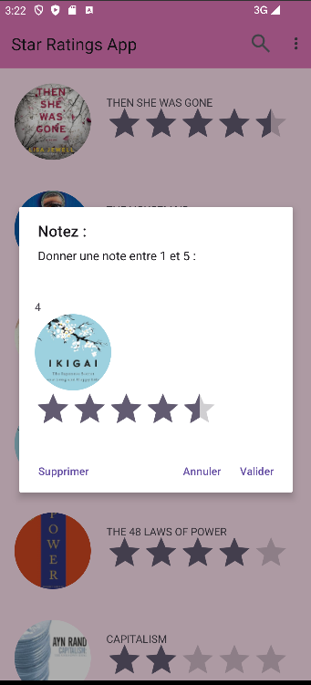
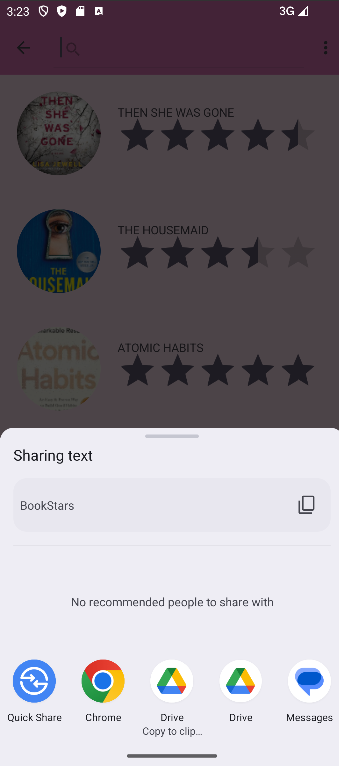

# Star Ratings App

## Description
L'application Star Ratings permet aux utilisateurs d'évaluer des livres à l'aide d'un système de notation par étoiles.  Les utilisateurs peuvent donner une note à chaque livre.

## Fonctionnalités
- **Affichage des livres** : L'application affiche une liste de livres avec leurs couvertures et notes.
- **Notation par étoiles** : Les utilisateurs peuvent noter les livres sur une échelle de 1 à 5 étoiles.
- **Recherche** : Un champ de recherche permet de filtrer les livres par nom.
- **Animations** : Une animation attrayante est présentée lors du démarrage de l'application pour améliorer l'expérience utilisateur.

## Fonctionnalité supplémentaire
- **Suppression des livres** : Les utilisateurs peuvent supprimer un livre à partir d'un `AlertDialog`.
- 
## Technologies Utilisées
- Android SDK
- Java
- Glide (pour le chargement des images)
- AndroidX RecyclerView
- API d'animation Android

## Installation
Pour exécuter cette application sur votre propre appareil Android, suivez les étapes ci-dessous :

**1.** Clonez ce dépôt sur votre machine locale : git clone https://github.com/aya-elloubab/Book-Star-Rating-Android-App.git
**2.** Ouvrez le projet dans Android Studio.  
**3.** Compilez et exécutez l'application sur un émulateur ou un appareil Android physique.  

## Captures d'écran

### Écran de démarrage

### Liste des livres

### Barre de recherche

### Popup pour chaque livre

### Ecran de Partage

